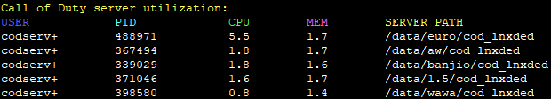

# Call of Duty server utilization

This function displays your current Call of Duty servers with the utilization and much more.

**What you need to do:**

- Simply download the file from here.
- Upload the file somewhere on your Linux system and give the file the following permissions:
  - `chmod 0770 utilization.sh`
- After youve done that, you can easily execute the file with `./utilization.sh`.

**You can/must also edit 2 functions if they are different for you or if you want something else:**
- The function `head -n 5` specifies how many servers or processes are displayed. Use the count that corresponds to the number of servers you have. In my case, it was `5`.
- And in the function `find_processes_by_command`, you will find the keyword that the function should look for, in this case, "`codserv`" as some hosts use this. Replace it with what you use.

There might be a few updates to this script in the future. Have fun with this little script!

> [!NOTE]
> Idea by TheWikiFesh & Made by Brejax
